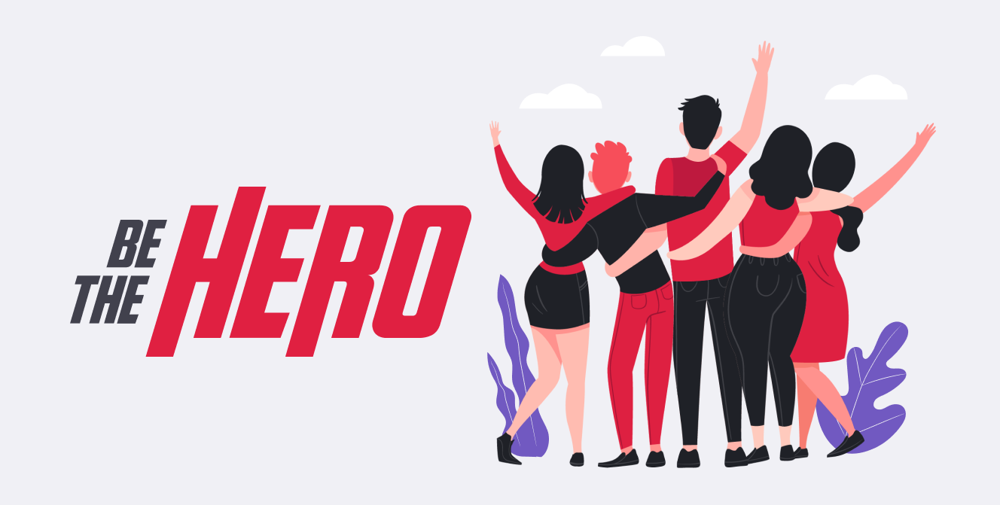

<h1 align="center">
    
</h1>

  
  
  
  

## Project 

An application which connects NGOs (non-governmental organizations) to a possible donors. In this platform the NGO can insert specific cases with the value needed for accomplishment, while a person can see these cases and can choose to get in contact and help the NGO in this specific case, that is, the person can **Be The Hero**.

## OmniStack Week

The project was developed for the Rocketseat's OminiStack Week 11.0. This event consist in a free online course (with certification) where is developed the back-end, front-end and mobile of an application through one week with a powerful stack, composed by:

- NodeJS
- ReactJS
- React Native

The course was given with one class a day:

- Day 1: Introductory Class
- Day 2: Back-end development
- Day 3: Front-end development
- Day 4: Mobile development
- Day 5: Advanced features

## Be More Than The Hero

From this application it was created a [project]([https://github.com/caiolcalves/BeTheHero/projects/2](https://github.com/caiolcalves/BeTheHero/projects/2)) to add new features and enhance the application. For all features to be added issues will be created and added to this project. The issues will be defined by my own learning demand. 

